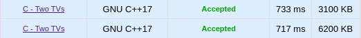
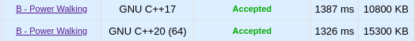
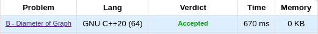

# Algoritmos Ambiciosos- Dupla 19

**Número da Lista**: 3 
**Conteúdo da Disciplina**: Algoritmos Ambiciosos 

## Alunos
|Matrícula | Aluno |
| -- | -- |
| 18/0023411  |  Maicon Lucas Mares de Souza |
| 18/0018574  |  Hérya Rodrigues Alcantara |

## Apresentação
<a href="https://youtu.be/oqZ2GUzfG54">Assistir apresentação</a>

## Sobre
Resolução de questões do [CodeForces](https://codeforces.com/) utilizando algoritmos ambiciosos. Todos os exercícios resolvidos possuem a tag "greedy".

### Problemas:

* [Problema 845C - Two TVs ](https://codeforces.com/contest/845/problem/C)
* [Problema 1642B - Power Walking ](https://codeforces.com/problemset/problem/1642/B)
* [Problema 1606C - Banknotes](https://codeforces.com/contest/1606/problem/C)
* [Problema 1581B - Diameter of Graph](https://codeforces.com/contest/1581/problem/B)

## Screenshots
### Problema 845C - Two TVs 

### Problema 1642B - Power Walking

### Problema 1606C - Banknotes

### Problema 1581B - Diameter of Graph

## Instalação
**Linguagem**: C++ 
* Clonar o repositório;
* Carregar o arquivo correspondente na página de submissão de cada problema;
* Selecionar linguagem "GNU C++20 (64) " ou "GNU C++17";
* Submeter resposta.

